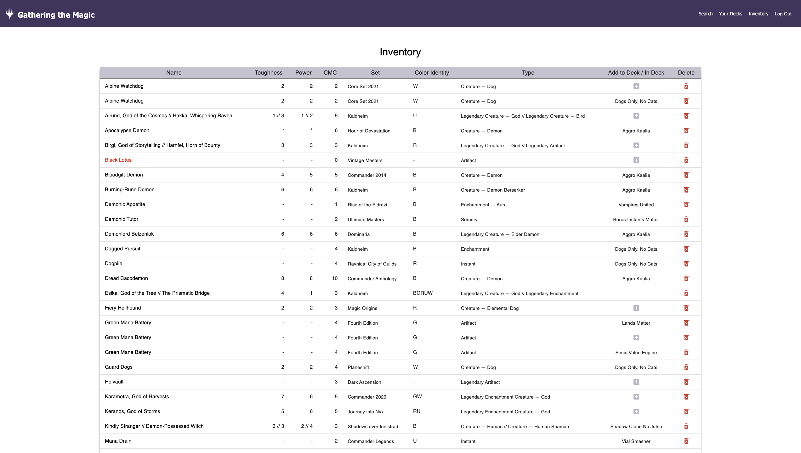
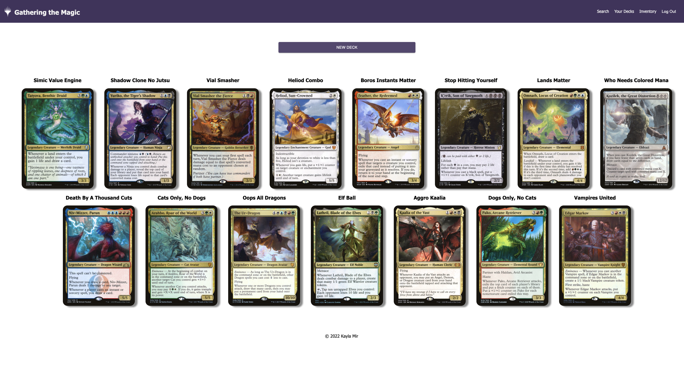
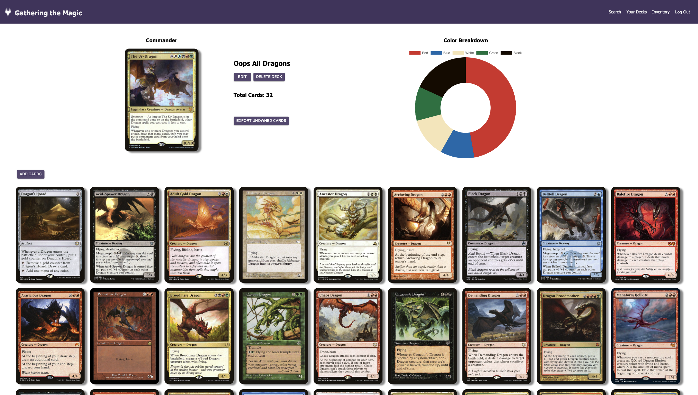
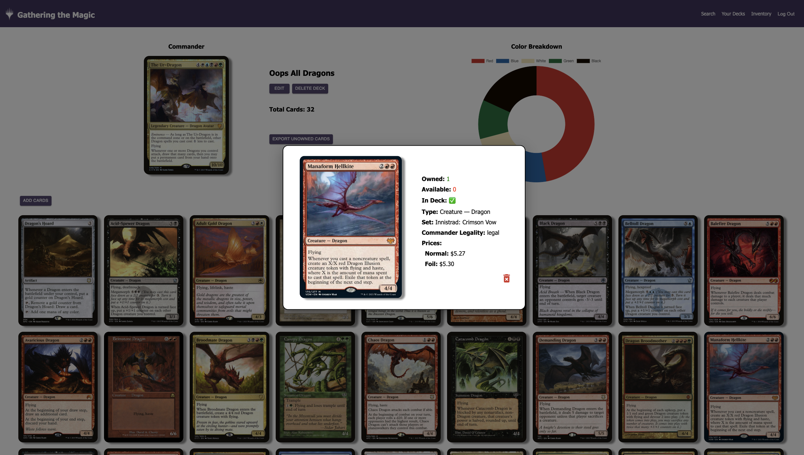

# Gathering the Magic

## Description

*Duration: Two Week Sprint*

This app is a react inventory management tool and deck creator for Commander(EDH) Magic the Gathering players. Users can search for cards using the Scryfall API. Making an account lets users save those cards to their inventory and put them into decks that they build. Users can see all of their cards in the inventory in an easy to read table. They can also see all of their decks on the Deck Page, clicking on one will bring them to the individual deck with all of the cards in it and a doughnut chart to show them the colors of that deck.

## Screen Shots
___
### Search Page

Displays the search results with the option to add 1 or more to your inventory. Clicking on a card will open a modal with more details.


### Inventory

Shows the user all of their cards with set, colors, type, etc also being displayed. Clicking on the name of the card will bring up a modal with more information if there is any. If a card isn't legal for Commander format the name will be displayed in red. Here users can also assign their cards to decks by hitting the plus icon and choosing the deck from a drop down and delete a card from their inventory.



### Decks Page

On the Decks Page users can see all of their deck ideas in one place. The name of the deck and the commander image are displayed here. Clicking on an image will bring them to the details view for that deck.



### Deck Details

On this page users can quickly and easily see their deck contents, add more cards to their deck, set/change the commander, see the color breakdown of their deck, export unowned cards to a .txt file and edit the name of the deck. Clicking on a card will open a modal with information about that card (see below screenshot).



### Deck View Modal

Here users can see if they own the card, how many are available, and if the card was added from the inventory. Other information is available too such as type, set, legality, and price information.



### Prerequisites

Link to documentation of software that I used.

- [Node.js](https://nodejs.org/en/)
- [Redux.js](https://redux.js.org/)
- [MaterialUI](https://mui.com/)
- [Scryfall API](https://scryfall.com/docs/api)
- [Chart.js](https://www.chartjs.org/docs/latest/)
- [React Hot Toast](https://react-hot-toast.com/docs)

## Installation
___

1. Create a database called ```solo_project```.
2. The queries in the database.sql file are set up to create all the necessary tables and populate the needed data to allow the application to run correctly. The project is built on [PostgreSQL](https://www.postgresql.org/download/), so you will need to make sure to have that installed. We recommend using [Postico](https://eggerapps.at/postico/) if you are using a Mac to run those queries as that was used to create the queries.
3. Open the project using your editor of choice and run ```npm install``` in the terminal.
4. Run ```npm run server``` in the terminal to start the server.
5. Run ```npm run client``` in the terminal to start the client.
6. Your browser will open a new tab with the project loaded!

## Usage
___

### Searching for Cards

1. When you first come to the app you won't have to log in to search for cards. 
2. Click on a card to open up a modal view with more information about that card (type, set, legality, cost).
3. Logging in/registering will allow you to save those cards from the search in your Inventory. 
4. You can choose to add more than one card at a time using the drop down at the bottom of the card to select a number and then hitting the 'Add to Inventory' button.

### Inventory Page

1. Here you can click on a cards name and a modal will open with information about the card. 
2. If the card is double sided there will be a flip icon on top of the image (this applies to any modal or image of a card almost anywhere on the app). Click the icon to turn the card over so the back can be seen.
3. On the main table click the plus icon on the right of the table to open up a small box asking which deck you would like to add that card to.
4. There will be a drop down with all of your available deck names. Choose one and hit the checkmark to add that card to the deck contents of that deck.

### Decks Page

1. Hitting the 'Your Decks' link at the top of the page will bring you to an overall view of your decks. 
2. Here you can see your decks displayed with their name and chosen commander as the image.
3. Click on the image of a deck to see more information about that deck.

### Detailed Deck View

1. The commander is displayed at the top of the page along with the name of the deck. 
2. The name of the deck can be changed by hitting the 'Edit' button, then type the new name into the input and hit save.
3. You can see the total amount of cards in that deck and also a breakdown of the colors using the doughnut chart.
4. Click on the 'Add Cards' button to open a dialog box to search for cards. 
5. Once you search for a card you have the option to set it as your commander or hit the add icon.
6. Clicking on the add icon will pop open a menu with 'Add from Inventory' or 'Add to deck'. Adding from your inventory will assign that card to the deck the same way it does in the inventory table. Add to deck will put that card in your deck as an unowned card.
7. Once your deck is all built and you are happy with the contents. Click on the 'Export Unowned Cards' button to open a .txt file with all the cards you don't own. You can take this list to a local game store to buy the cards or to an online website such as [TCGPlayer's Mass Entry](https://www.tcgplayer.com/massentry).

## Built With
___

- Javascript
- React
- Redux
- Node.js
- Axios
- PostgreSQL
- MaterialUI
- Sweetalert
- Chart.JS
- React Hot Toast
- Scryfall API
- HTML/CSS

## Acknowledgement
___

Thanks to Prime Digital Academy who equipped and helped me to make this application a reality. Special thanks to my instructor [Matthew Black](https://github.com/matthew-black)!

## Support
___

If you have suggestions or issues, please email me at [kayla.mir32@gmail.com](mailto:kayla.mir32@gmail.com).  